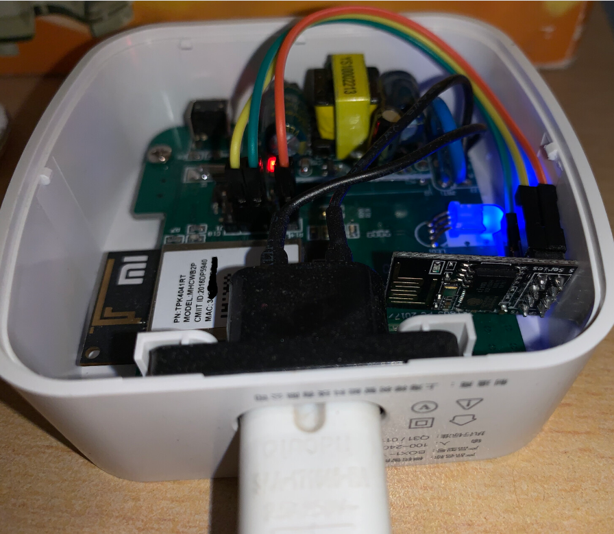

# mqttl
Integrate all types of Xiaomi (Mijia) BLE devices into Home Assistant, by relaying messages from Gateway's TTL to MQTT, running on ESP-01S (ESP8266).

Frok from https://github.com/killadm/LOCK2MQTT, thks to killadm!

It will relay the information of did/eid/edata from all the ttl messages contain *ble_event* to hass instance via mqtt, with the topic of *mqttl/did xxxx/eid xxx* and payload of edata. 
On the HA side, the value of edata will be used to mapped to individual sensors.

Works with multiple BLE Gateways of different types and any kinds of Xiaomi (Mijia) BLE devices.

### Usage
1. Flash ESP module (by usb-ttl or OTA);
2. Connect to the TTL pins of BLE Gateway device;
3. Join the AP named *mqttl_xxxx*, with the password of *mqttlpassword*;
4. Configure WiFi and MQTT broker;
5. Configure the sensors by yaml in Home Assistant (this step could be accomplished before flash ESP).

### Connection

### example of yaml
- lock.yaml: Zelkova K1 Smart Lock
- flora.yaml: HHCCJCY01
- tmhm.yaml: LYWSD03MMC
*设备did* need to be replaced with correct dids
